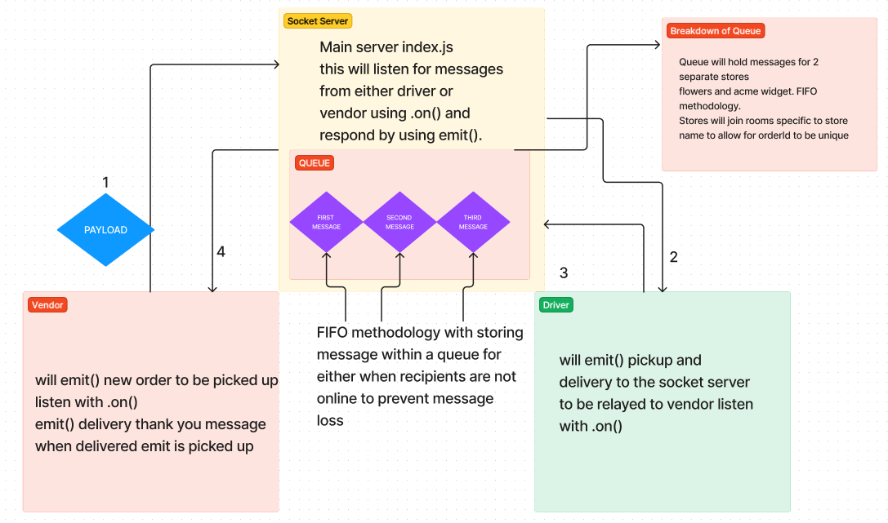

# LAB - Class 13

## Project: Lab 12: Building message queue

### Author: Reece Renninger

### Problem Domain  

This is the start of a 4 build phase for a CAPs system built in Node.js.  Initial goal is to set up a pool of events and handlers that communicate with each other based on a package in its different steps along its way to being delivered. These interactions will be completed using socket.io and socket.io-client. Implementing a message/event queue to store so that nothing is missed in case a receipent is offline.

Major functionality to cover in lab:

    As a vendor, I want to “subscribe” to “delivered” notifications so that I know when my packages are delivered.
    As a vendor, I want to “catch up” on any “delivered” notifications that I might have missed so that I can see a complete log.
    As a driver, I want to “subscribe” to “pickup” notifications so that I know what packages to deliver.
    As a driver, I want to “catch up” on any “pickup” notifications I may have missed so that I can deliver everything.
    As a driver, I want a way to “scan” a delivery so that the vendors know when a package has been delivered.

### Links and Resources

- [GitHub Actions ci/cd](https://github.com/ReeceRenninger/caps/actions)

### Collaborators

- 

### Setup

- Clone repo, npm i jest dotenv socket.io chance eslint socket.io-client. You will have to run 4 terminals and cd into each folder and run node index.js to get them live. Proof of life should be server terminal showing connection to caps namespace for each folder terminal.

#### `.env` requirements (where applicable)

env = < port-of-your-choice >

#### How to initialize/run your application (where applicable)

- e.g. `npm start`

#### How to use your library (where applicable)

#### Features / Routes

- Socket server communication between 3 separate instances all communicating through the main server index.

#### Tests

- Tests have been built out to ensure the handlers are emitting the correct messages.
- These can be ran using npm test (filename) or npm test.

#### UML

