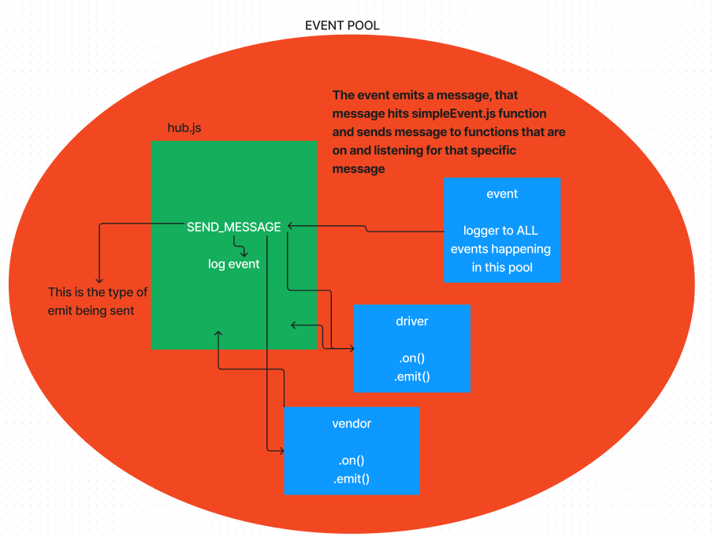

# LAB - Class 11: Event Driven Applications

## Project: Lab 11: Event Driven Applications

### Author: Reece Renninger

### Problem Domain  

This is the start of a 4 build phase for a CAPs system built in Node.js.  Initial goal is to set up a pool of events and handlers that communicate with each other based on a package in its different steps along its way to being delivered.

Major functionality to cover in lab:

    As a vendor, I want to alert the system when I have a package to be picked up.
    As a driver, I want to be notified when there is a package to be delivered.
    As a driver, I want to alert the system when I have picked up a package and it is in transit.
    As a driver, I want to alert the system when a package has been delivered.
    As a vendor, I want to be notified when my package has been delivered.

### Links and Resources

- [GitHub Actions ci/cd](https://github.com/ReeceRenninger/caps/actions/new) 
- [back-end server url](http://xyz.com) (when applicable)

### Collaborators

### Setup

#### `.env` requirements (where applicable)

for now I have none and do not require one

#### How to initialize/run your application (where applicable)

- e.g. `npm start`

#### How to use your library (where applicable)

#### Features / Routes

- Feature One: Details of feature
- GET : `/hello` - specific route to hit

#### Tests

- Tests have been built out to ensure the handlers are emitting the correct messages.
- These can be ran using npm test (filename).

#### UML

